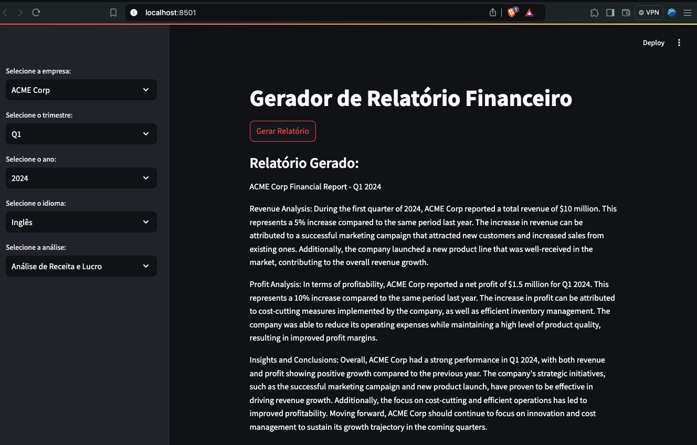

## Financial Report Generator

This project is a web application that generates financial reports using LangChain and Streamlit, integrating OpenAI’s API to provide natural language analysis. The application allows users to generate detailed financial reports based on provided data, leveraging the power of Large Scale Language Models (LLM).

</br>
<p align="center">
  <kbd>
  
  </kbd>
  </br>
</p>
</br>


### ⌨ Technologies used

-   [langchain_openai](https://python.langchain.com/v0.2/docs/integrations/platforms/openai/) - version 0.1.16
-   [langchain_experimental](https://pypi.org/project/langchain-experimental/) - version 0.0.62
-   [langchain](https://www.langchain.com/ ) - version 0.2.7
-   [openai](https://pypi.org/project/openai/) - version 1.35.13
-   [streamlit](https://streamlit.io/) - version 1.36.0
-   [PyYAML](https://pypi.org/project/PyYAML/) - version 6.0.1
 

### ⌨ Installation
To use it, you need to clone the repository, install the dependencies and run the project. You also need to create a .yaml file and add your OPENAI_API_KEY key. If you have any questions, access [Open AI](https://platform.openai.com/docs/guides/text-generation).

```bash
# Open terminal/cmd and then clone this repository
$ git clone https://github.com/JuanCampbsi/financial-report-langchain.git

# Access the project folder in the terminal/cmd
$ cd financial-report-langchain

# Create a virtual environment
$ pip install virtualenv

# Active your virtual environment
$ source venv/bin/activate

# Install the necessary tools
$ pip install -r requirements.txt

# Run the command in the terminal
$ streamlit run app.py                               

```

👨‍💻 **Author -  Software Developer ** 💻


[](https://www.linkedin.com/in/juancampos-ferreira/) 


