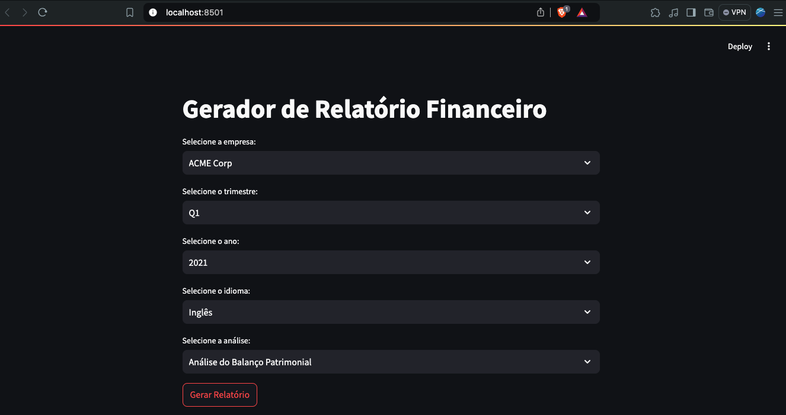
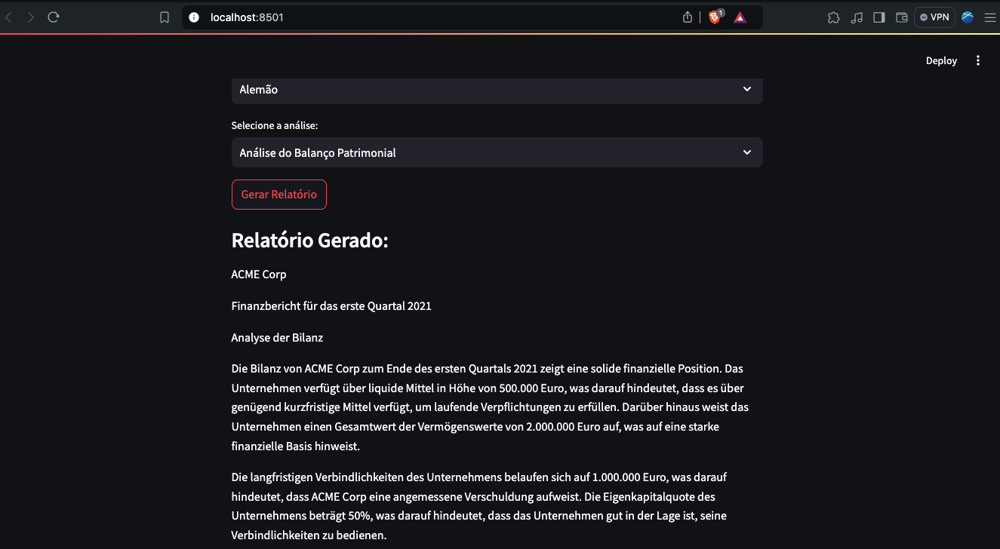

## Gerador de relatório financeiro

Este projeto é uma aplicação web que gera relatórios financeiros utilizando LangChain e Streamlit, integrando a API da OpenAI para fornecer análises de linguagem natural. A aplicação permite que os usuários gerem relatórios financeiros detalhados com base em dados fornecidos, aproveitando o poder dos Modelos de Linguagem de Grande Escala (LLM).

</br>
<p align="center">
  <kbd>
  
  </kbd>
  </br>
</p>
</br>

</br>
<p align="center">
  <kbd>
  
  </kbd>
  </br>
</p>
</br>


### ⌨ Tecnologias utilizadas

-   [langchain_openai](https://python.langchain.com/v0.2/docs/integrations/platforms/openai/) - version 0.1.16
-   [langchain_experimental](https://pypi.org/project/langchain-experimental/) - version 0.0.62
-   [langchain](https://www.langchain.com/ ) - version 0.2.7
-   [openai](https://pypi.org/project/openai/) - version 1.35.13
-   [streamlit](https://streamlit.io/) - version 1.36.0
-   [PyYAML](https://pypi.org/project/PyYAML/) - version 6.0.1
 

### ⌨ Instalação
Para utilizá-lo, é necessário clonar o repositório, instalar as dependências e executar o projeto.

```bash
# Abra terminal/cmd e depois clone este repositório
$ git clone https://github.com/JuanCampbsi/financial-report-langchain.git

# Acesse a pasta do projeto no terminal/cmd
$ cd financial-report-langchain

# Crie um ambiente virtual
$ pip install virtualenv

# Ative seu ambiente virtual
$ source venv/bin/activate

# Instale as ferramentas necessárias
$ pip install -r requirements.txt

# Execute o comando no terminal
$ streamlit run app.py                               

```

👨‍💻 **Author -  Software Developer ** 💻


[](https://www.linkedin.com/in/juancampos-ferreira/) 


